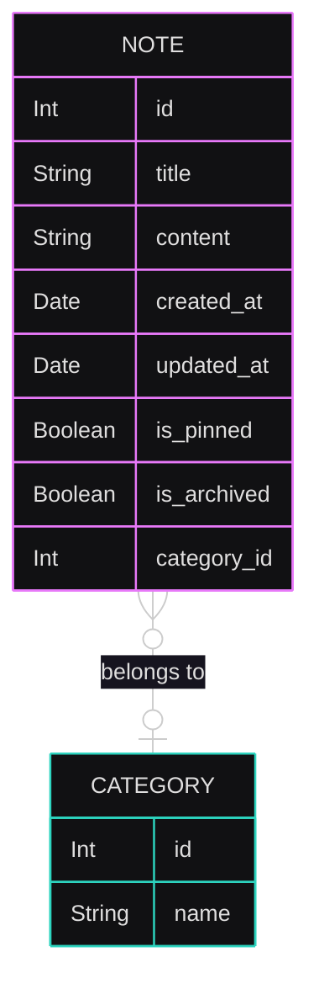

# Scribl

## Database Entity Relationship Diagram

```mermaid
---
config:
  theme: "redux-dark-color"
  themeVariables:
    fontFamily: monospace
---
erDiagram
    NOTE }o--o| CATEGORY : "belongs to"
    NOTE {
        Int id
        String title
        String content
        Date created_at
        Date updated_at
        Boolean is_pinned
        Boolean is_archived
        Int category_id
    }
    CATEGORY {
        Int id
        String name
    }
```
